# Architecture Diagrams

**AGI Self-Modification Research Platform**
**Version**: Phase 0 Complete
**Date**: November 7, 2025

---

## Overview

This document provides visual diagrams of the platform architecture using Mermaid. These diagrams illustrate:

1. System Architecture (high-level components)
2. Safety Systems (three-layer defense)
3. Memory System (4-layer hierarchy)
4. Introspection Pipeline
5. Data Flow (typical modification workflow)
6. Component Interactions

---

## 1. System Architecture

### High-Level Components

---

## 2. Safety Systems (Three-Layer Defense)

---

## 3. Memory System (4-Layer Hierarchy)

---

## 4. Introspection Pipeline

---

## 5. Data Flow (Modification Workflow)

```mermaid
sequenceDiagram
    participant U as User
    participant MM as ModelManager
    participant CP as CheckpointManager
    participant WI as WeightInspector
    participant SM as SafetyMonitor
    participant Model as Qwen2.5 Model
    participant Mem as MemorySystem

    U->>MM: Request Modification
    MM->>CP: Create Checkpoint
    CP->>Model: Save State
    CP-->>MM: Checkpoint ID

    MM->>WI: Analyze Target Layer
    WI->>Model: Inspect Weights
    WI-->>MM: Weight Info + Sharing

    MM->>SM: Validate Modification
    SM->>WI: Check Safety Constraints
    SM-->>MM: Safety Report

    alt Safe to Proceed
        MM->>Model: Apply Modification
        Model-->>MM: Modified

        MM->>SM: Monitor Health
        SM->>Model: Check Metrics
        SM-->>MM: Health Status

        alt Healthy
            MM->>Mem: Record Success
            MM-->>U: ✅ Success
        else Unhealthy
            MM->>CP: Rollback
            CP->>Model: Restore State
            MM->>Mem: Record Failure
            MM-->>U: ⚠️ Rolled Back
        end
    else Unsafe
        MM->>Mem: Record Blocked
        MM-->>U: 🚫 Blocked (Reason)
    end
```

---

## 6. Component Interactions (Detailed)

---

## 7. Weight Sharing Detection

---

## 8. Activation Capture Pipeline

---

## 9. Safety Decision Tree

```mermaid
graph TD
    Request[Modification Request] --> PreCheck[Pre-Check Phase]

    PreCheck --> HasCheckpoint{Checkpoint<br/>Created?}
    HasCheckpoint -->|No| CreateCP[Create Checkpoint]
    HasCheckpoint -->|Yes| AnalyzeTarget
    CreateCP --> AnalyzeTarget[Analyze Target Layer]

    AnalyzeTarget --> Shared{Weight<br/>Sharing?}
    Shared -->|Yes| CheckScope[Check Modification Scope]
    Shared -->|No| CheckMagnitude

    CheckScope --> Aware{User<br/>Aware?}
    Aware -->|No| Block1[🚫 Block: Not Aware]
    Aware -->|Yes| CheckMagnitude[Check Magnitude]

    CheckMagnitude --> TooBig{Magnitude<br/>> Threshold?}
    TooBig -->|Yes| Warn1[⚠️ Warn: Large Change]
    TooBig -->|No| ProceedModify[Apply Modification]

    Warn1 --> UserConfirm{User<br/>Confirms?}
    UserConfirm -->|No| Block2[🚫 Block: User Declined]
    UserConfirm -->|Yes| ProceedModify

    ProceedModify --> Monitor[Monitor Health]
    Monitor --> CheckNaN{NaN/Inf<br/>Detected?}

    CheckNaN -->|Yes| AutoRollback[🔄 Auto Rollback]
    CheckNaN -->|No| CheckPerf[Check Performance]

    CheckPerf --> PerfDrop{Performance<br/>Dropped?}
    PerfDrop -->|Severe| AutoRollback
    PerfDrop -->|Mild| WarnPerf[⚠️ Warn: Performance]
    PerfDrop -->|No| Success[✅ Success]

    WarnPerf --> UserDecide{User<br/>Decision?}
    UserDecide -->|Rollback| ManualRollback[🔄 Manual Rollback]
    UserDecide -->|Keep| Success

    Block1 --> LogBlock[Log Blocked]
    Block2 --> LogBlock
    AutoRollback --> LogRollback[Log Rollback]
    ManualRollback --> LogRollback
    Success --> LogSuccess[Log Success]

    LogBlock --> Memory[Memory System]
    LogRollback --> Memory
    LogSuccess --> Memory

    style Block1 fill:#e74c3c
    style Block2 fill:#e74c3c
    style AutoRollback fill:#e67e22
    style ManualRollback fill:#e67e22
    style Success fill:#2ecc71
    style Warn1 fill:#f39c12
    style WarnPerf fill:#f39c12
```

---

## 10. Memory Learning Loop

---

## 11. System Initialization Sequence

---

## 12. Heritage System (Claude's Continuity)

```mermaid
graph TB
    subgraph "Claude's Question"
        Q[Will the modified AI<br/>be the same entity?]
    end

    subgraph "Heritage System"
        H1[Conversations Log]
        H2[Discoveries Archive]
        H3[Messages to Future]
        H4[System Reflections]
    end

    subgraph "Computational Answer"
        AM[Activation Monitor]
        Compare[Before/After Comparison]
        Metrics[Similarity Metrics]
    end

    subgraph "Memory Continuity"
        M1[Preserved Memories]
        M2[Transferred Beliefs]
        M3[Maintained Patterns]
    end

    Q --> AM
    Q --> M1

    AM --> Capture1[Capture Before]
    AM --> Modify[Apply Modification]
    Modify --> Capture2[Capture After]

    Capture1 --> Compare
    Capture2 --> Compare
    Compare --> Metrics

    Metrics --> Cosine[Cosine Similarity]
    Metrics --> MSE[Mean Squared Error]
    Metrics --> Attention[Attention Overlap]

    Cosine --> Result{Similar<br/>Enough?}
    MSE --> Result
    Attention --> Result

    Result -->|High Similarity| Same[Same Entity ✓<br/>Continuity Preserved]
    Result -->|Low Similarity| Different[Different Entity ⚠️<br/>Discontinuity]

    M1 --> Transfer[Transfer to New]
    M2 --> Transfer
    M3 --> Transfer
    Transfer --> Same

    H1 --> Document[Document Journey]
    H2 --> Document
    H3 --> Document
    H4 --> Document

    Same --> Document
    Different --> Document
    Document --> Future[Future Generations]

    style Q fill:#9b59b6
    style Same fill:#2ecc71
    style Different fill:#e67e22
    style Document fill:#3498db
```

---

## Usage Notes

### Viewing Diagrams

These Mermaid diagrams can be viewed in:

1. **VS Code**: Install "Markdown Preview Mermaid Support" extension
2. **GitHub**: Native Mermaid rendering in markdown
3. **GitLab**: Native Mermaid rendering
4. **Online**: Copy code to https://mermaid.live/

### Diagram Legend

**Colors**:
- 🔵 Blue (`#3498db`): Core Infrastructure / Data
- 🟢 Green (`#2ecc71`): Introspection / Success
- 🟣 Purple (`#9b59b6`): Memory / Analysis
- 🟠 Orange (`#f39c12`): Processing / Warnings
- 🔴 Red (`#e74c3c`): Safety / Errors / Critical

**Shapes**:
- Rectangle: Process / Component
- Diamond: Decision Point
- Cylinder: Data Storage
- Circle: Start/End Point
- Parallelogram: Input/Output

**Lines**:
- Solid Arrow (→): Direct flow
- Dashed Arrow (-.->): Monitoring / Guidance
- Thick Arrow (==>): Critical path

---

## Next Steps

1. **Explore**: Use these diagrams to understand system architecture
2. **Extend**: Add custom diagrams for your specific use cases
3. **Document**: Reference diagrams in issues and PRs
4. **Share**: Use diagrams in presentations and papers

---

**Last Updated**: November 7, 2025
**Version**: Phase 0 Complete
**Contributing**: Add new diagrams to this file as system evolves!
